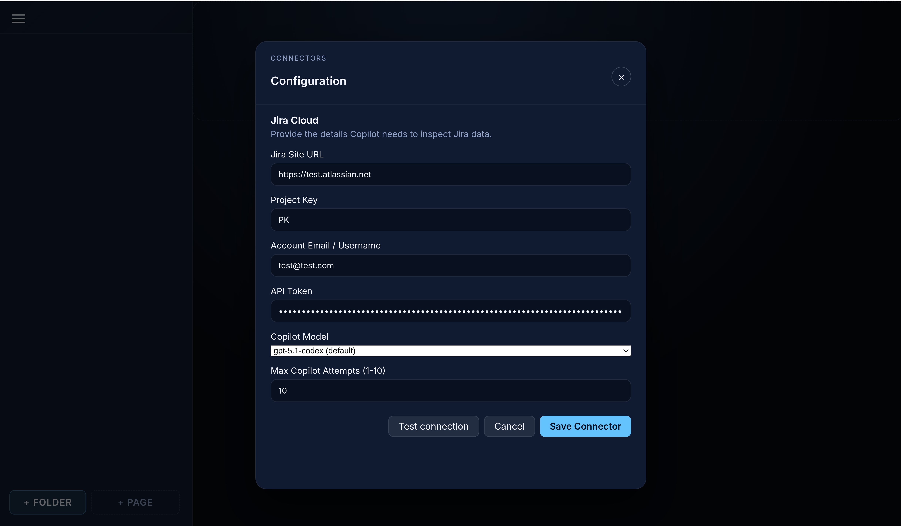
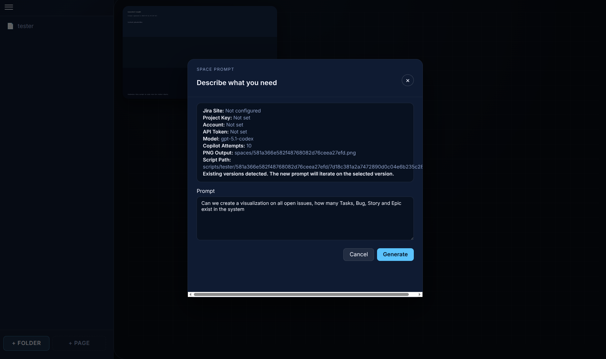
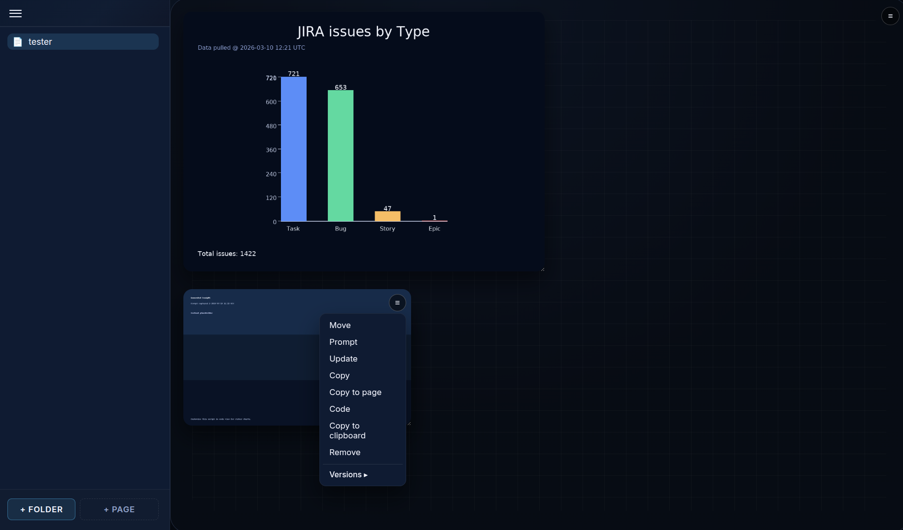
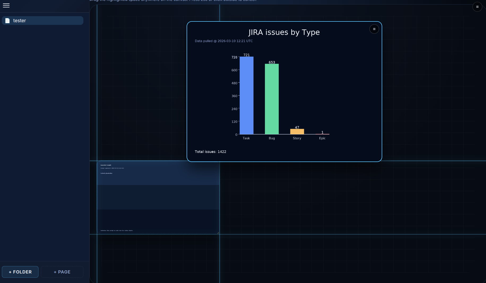
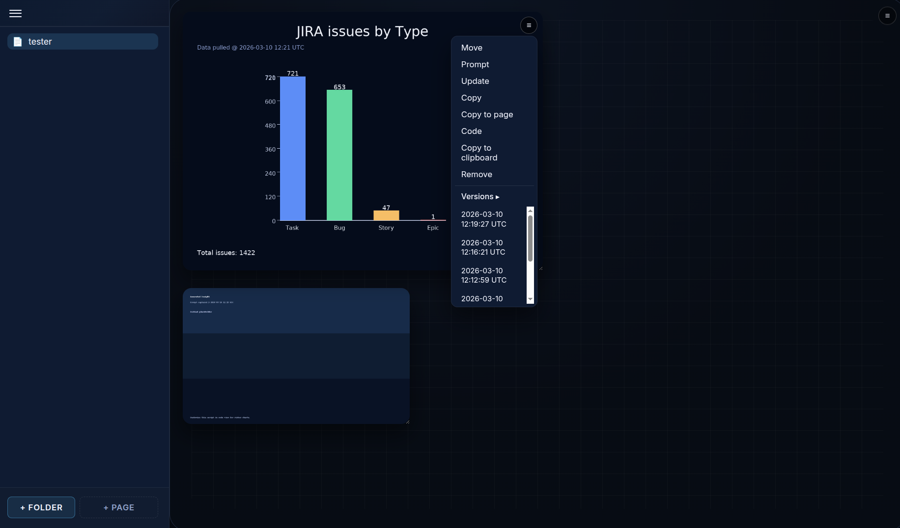

# Vizit

Vizit is a self-hosted visualization workbench that pairs your Atlassian data with agentic GitHub Copilot CLI workflows so you can prompt, iterate, and version bespoke dashboards in minutes.

## Highlights
- Generate any visualization by prompting Copilot; use follow-up prompts to iterate until the output matches your intent.
- Keep a full history of prompts, scripts, and rendered images so you can roll back or compare versions at any time.
- Organize insights into pages, folders, and freely positioned "spaces" that can be duplicated or moved across the canvas.
- Copy rendered artifacts (images or underlying scripts) to the clipboard for downstream sharing or reuse.
- Connect directly to Jira Cloud projects while staying in control of your API tokens and Copilot usage.

## Prerequisites
- Python 3.10+ and pip
- [GitHub Copilot CLI](https://github.com/github/copilot-cli) installed and authenticated on the same machine
- A Jira Cloud project plus an Atlassian API token (required for Jira-backed spaces)
- A modern Chromium, Firefox, or Safari browser

## Installation
```bash
python -m venv .venv
source .venv/bin/activate
pip install -r requirements.txt
```
> On Windows, run `.venv\Scripts\activate` instead of `source ...`.

## Running Vizit
### Development server
```bash
flask --app app run --debug
```
Open http://127.0.0.1:5000 and begin adding pages/spaces from the sidebar. 

## Screenshots
Configure your system


Give your prompt, what do you want to show


The AI agent will start to generate the vizualization


You can create multiple spaces, each space is a visualization


You can organise your spaces how you want, free transform and move


When you evolve your visualization, you can go back and forward in versions


## License

This project is distributed under the terms of the [GNU Affero General Public License v3.0](LICENSE).
